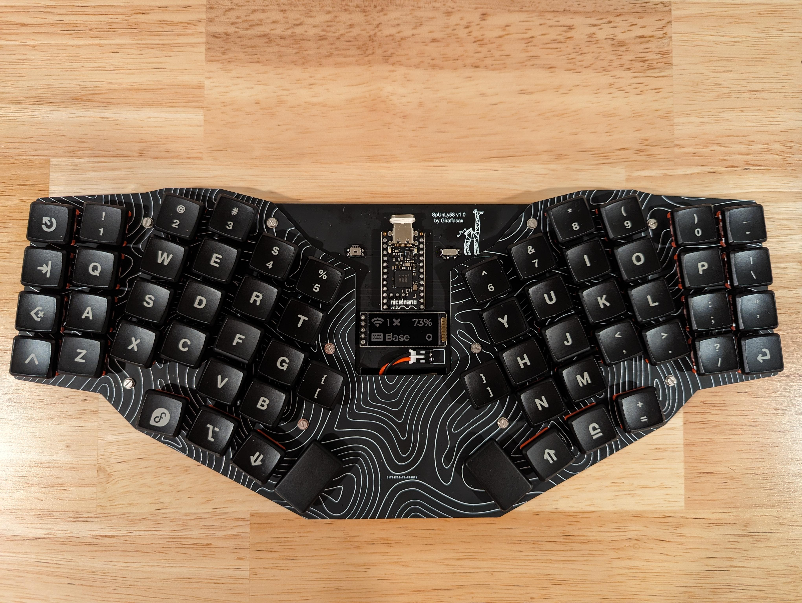
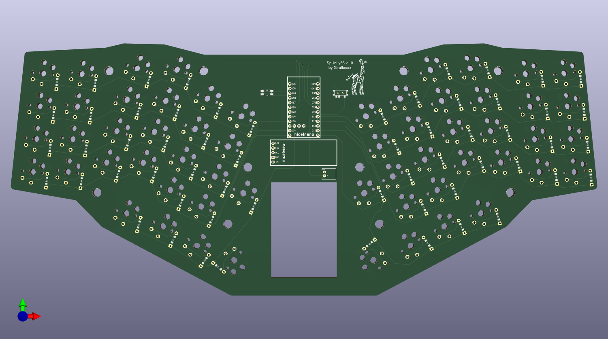
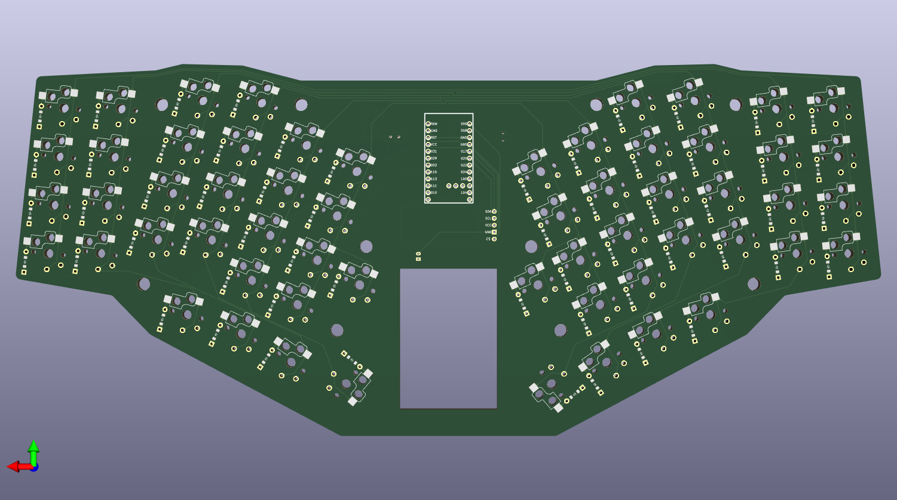

# The SpUnLy58 Keyboard
The SpUnLy58 is **Sp**layed **Un**ibody Li**ly58** layout [6*4 + 4key] keyboard. This is a minimal design keyboard that is wireless first. This design requires a Nice!Nano v2, supports a Nice!View,there are no LEDs, and a case is recommended to protect the up to 750mAh battery.

## Notable Features
- Choc V1 support [Hotswap and Soldered]
- "Split" unibody design with 20 deg angle (measured at middle finger column)
- Column Stagger
- Aggressive Pinky Splay with Minimal splay for all other columns
- Fanned Thumb Cluster
- Nice!Nano v2 **[ REQUIRED ]**
- Nice!View Support
- JST Battery Connector

SpUnLy58 v1 PCB top

SpUnLy58 v1 PCB bottom

___
## Parts List
| Name | Quantity | Example URL |
|------|----------|-------------|
| SpUnLy58 PCB | 1  | https://github.com/Giraffasax/SpUnLy58/blob/main/KiCad/Gerber/SpUnLy58_Gerber.zip |
| Kailh Choc v1 Switches | 58 | https://typeractive.xyz/products/choc-switches?variant=46024772387047 |
| Kailh Choc v1 Keycaps (Choc Spacing) | 58 | https://fkcaps.com/custom/create/keycaps?option=mbk-pbt-pu&color=black |
| Nice!Nano v2 | 1 | https://typeractive.xyz/products/nice-nano |
| Nice!View or OLED (Optional) | 1 | https://typeractive.xyz/products/nice-view |
| Mill Max Ultra Low Profile Sockets (Optional) | 2 | https://www.littlekeyboards.com/collections/miscellaneous/products/ultra-low-profile-sockets |
| 1N4148W Diodes (SMD or TH) | 58 | https://typeractive.xyz/products/smd-diodes |
| Kailch Choc Hotswap Sockets (Optional) | 58 | https://typeractive.xyz/products/hotswap-sockets?variant=45742200324327 |
| Panasonic EVQPU Reset Switch | 1 | https://typeractive.xyz/products/reset-button |
| Alps miniature SPDT switch | 1 | https://typeractive.xyz/products/power-switch |
| JST PH 2.0mm Battery Jack | 1 | https://typeractive.xyz/products/battery-jack |
| 3.7v 750mAh 403450 Battery | 1 | https://typeractive.xyz/products/lithium-battery-750mah |

Note: I used the ultra low profile Mill Max sockets for both the controller and display to have them sit lower than the switch height to protect them in travel.

## Sandwich Case Part List
| Name | Quantity | Example URL |
|------|----------|-------------|
| Bottom Plate | 1 | https://github.com/Giraffasax/SpUnLy58/blob/main/KiCad/Gerber/Bottom_Plate_Gerber.zip |
| Top Plate | 1 | https://github.com/Giraffasax/SpUnLy58/blob/main/KiCad/Gerber/Top_Plate_Gerber.zip |
| 6mm M2 Standoffs | 10 | https://splitkb.com/products/brass-m2-spacers?variant=42396969140483 |
| 4mm M2 Screws | 20 | https://splitkb.com/products/m2-screws?_pos=2&_sid=9c9502b8a&_ss=r |

## Firmware
ZMK Firmware: https://github.com/Giraffasax/zmk-SpUnLy58-config
