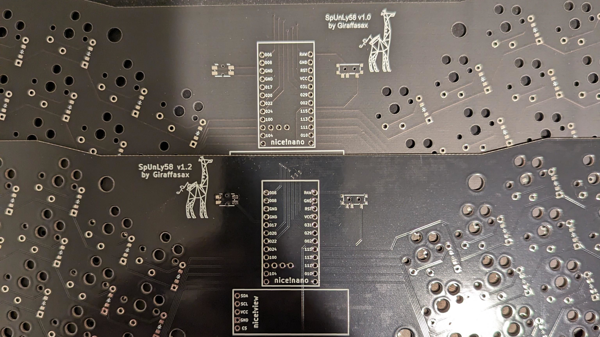
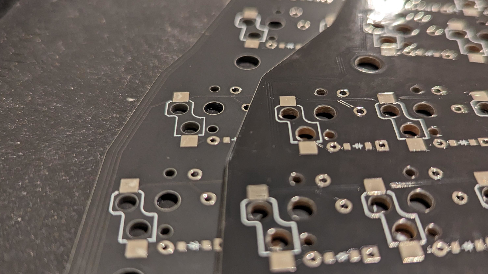
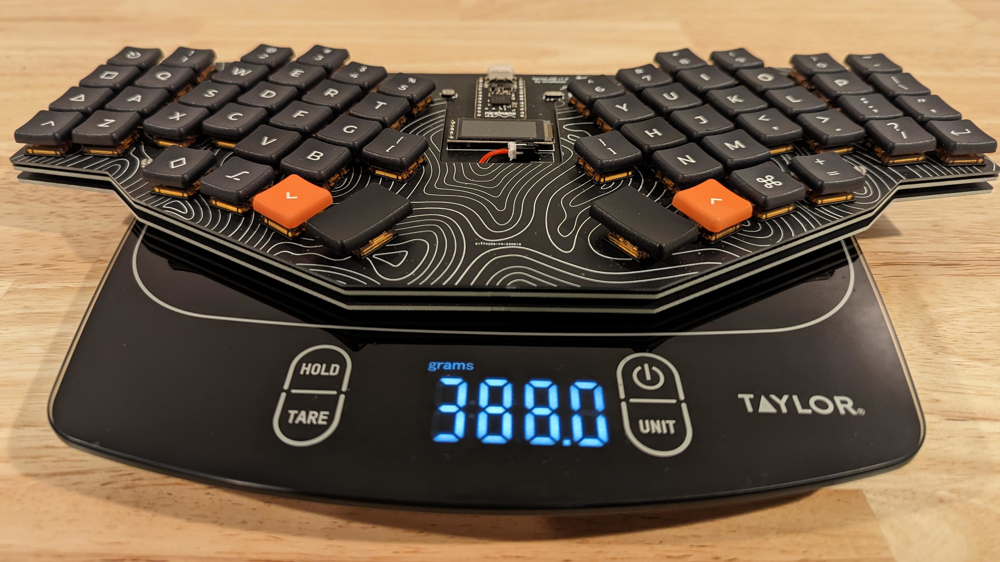

# PCBWay Sponsored Review
## Background
After posting v1.0 of this project and it gaining some traction a PCBWay representative reached out to see if I would want them to sponsor my next iteration in exchange for a review. So I want to be up front that **I did receive a voucher for their services** which I used to help pay for the 5 main PCBs and 2 stainless steel bottom plates. I did not send this review to them beforehand. However, after posting the original review I was contacted and asked to remove the name of the competing China PCB manufacturer. To meet this request I have redacted the name and replaced it with "Unnamed PCB Supplier".

## Physical Comparison

[top] "Unnamed PCB Supplier" Black [bottom] PCBWay Black

First when comparing v1.0 that was printed by "Unnamed PCB Supplier" to v1.2 printed by PCBWay you can see that the "Unnamed PCB Supplier" "Black" PCB is a matte finish and a lighter tone while PCBWay's is a deeper black with a glossy finish. If you want a matte black from PCBWay there will be a slight up charge.

I was unable to directly compare the PCB weights as I added a ground fill on v1.2 that added quite a bit more material.

[left] "Unnamed PCB Supplier" Black [right] PCBWay Black

Inspecting the pads and through holes on the PCBs I had a difficult time finding any differences on these very simple keyboard designs without any embedded controllers or other small components. The only difference I was able to see was a slight "wavy" appearance on the "Unnamed PCB Supplier" pads compared to the smoother appearance of the PCBWay. However I could not feel any variation in height of the "Unnamed PCB Supplier" pads and it did not affect my soldering whatsoever. So this is likely just cosmetic.

Stainless Steel Bottom Plate (PCBWay)

I also put my PCBWay voucher towards getting a nice pair of stainless steel bottom plates for my work and home boards. I was able to upload a STEP file of the bottom plate to their "Sheet Metal" quote system. This service can be used for laser cutting and bending, but all I required was cutting. I selected a standard thickness of 1.5mm and chose a bead blasted finish which I think came out great.

SpUnLy58 v1.0 assembled weight

SpUnLy58 v1.2 assembled weight

It also provides a pleasant heft. They have multiple options for each of the following materials: mild steel, stainless steel, aluminum, copper/brass, and acrylic. I think this service would also be a great option for switch plates or bent cases depending on your budget. "Unnamed PCB Supplier" and PCBWay also have 3d printing services that I have not tested.

## Purchase Experience
In both of my purchases with "Unnamed PCB Supplier" I submit my Gerber files, select my settings, and purchase. There seem to be some automated checks and they come back with pricing changes based on my PCBs. (ie. large number of cuts in the switch plate increasing the cost by $7.50)

When I did the same part submission process to PCBWay, I was asked some follow up questions by one of their engineers that helped me realize that I had accidentally uploaded the wrong gerber file. I was able to just email them the correct file, they updated my order, and I avoided a huge blunder. Now I cannot say whether or not they give this attention to all orders or just sponsored orders as this was my first purchase from them.

## Price Comparison (USD)
Now as this is a large unibody design with a number row [approx. 320x140mm] the prices are much higher compared to smaller DIY boards out there. Each value below is the cost of for a minimum order of 5 PCBs. Shipping was the cheapest available, typically DHL Express.

I chose the same settings for the PCBs. Black, 2-Layer, 1.6mm thick (1.2 for switch plate), HASL lead free.

| PCB Costs                   | Switch Plate | PCB    | Bottom Plate | Shipping |
|-----------------------------|--------------|--------|--------------|----------|
| "Unnamed PCB Supplier" v1.0 | $28.60       | $24.69 | $24.69       | $58.96   |
| "Unnamed PCB Supplier" v1.2 | $29.72       | N/A    | $22.22       | $38.06   |
| PCBWay v1.2                 | N/A          | $94.80 | N/A          | $30.56   |

Cost for two 1.5mm stainless steel bottom plates to be laser cut and bead blasted from PCBWay was **$80.12**

As you can see there was a reason why I didn't use PCBWay for all components of the build. Tinkering with the online quote system PCBWay can be 4-5x the cost of "Unnamed PCB Supplier" (before shipping). This isn't very noticeable on small boards where the difference is a few bucks. But when you scale it up to a board of my size the cost difference is sizable and it was cheaper to get 2 nice stainless steel bottom plates than have them cutout 5 plain FR4 plates.

## Conclusion
Overall PCBWay has slightly better cosmetic consistency with their pads, the customer service was great, and they have a lot of cool manufacturing options for metal and plastic materials. If you are looking to make a smaller board I recommend them, however for a large board like mine I cannot justify the price discrepancy without a sponsored voucher.

If you would like a more in depth review of PCBWay and other suppliers and their capabilities on a more complex PCB design, I recommend [Icamtuf's substack post.](https://lcamtuf.substack.com/p/comparing-hobby-pcb-vendors)